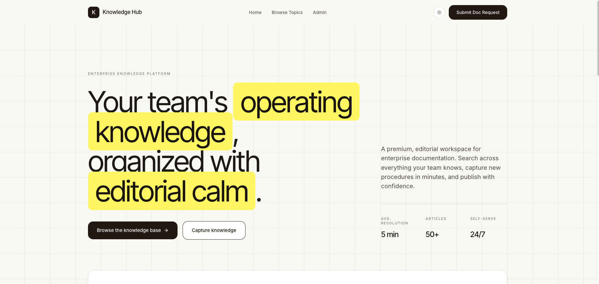
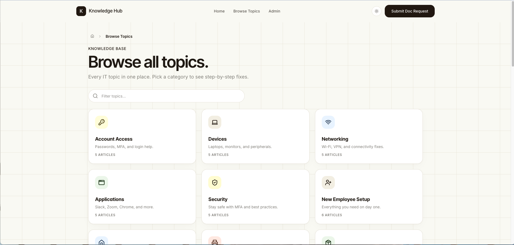
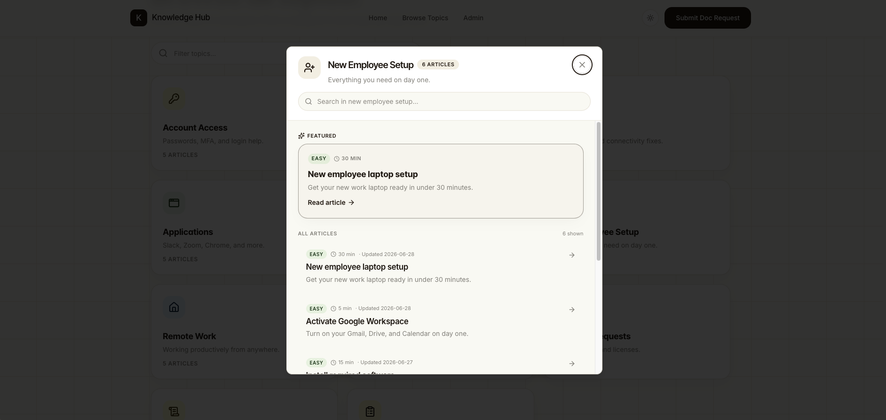
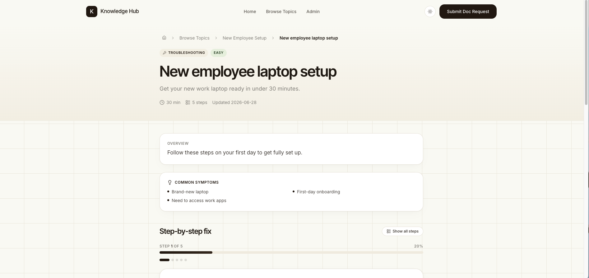
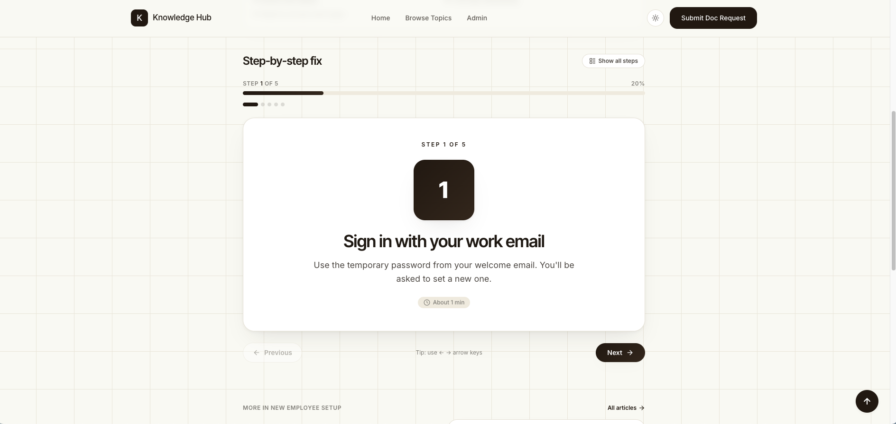
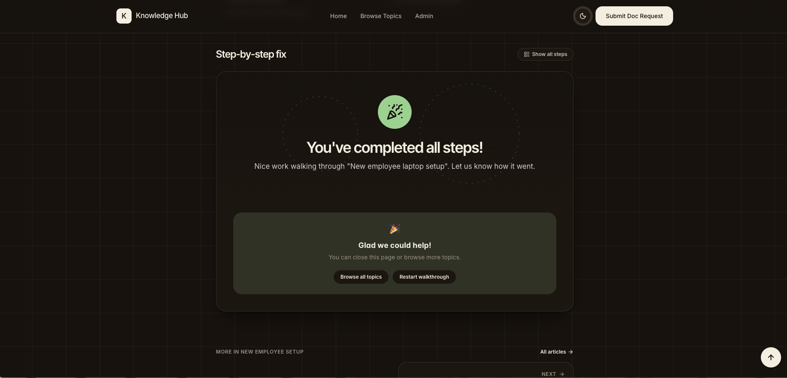
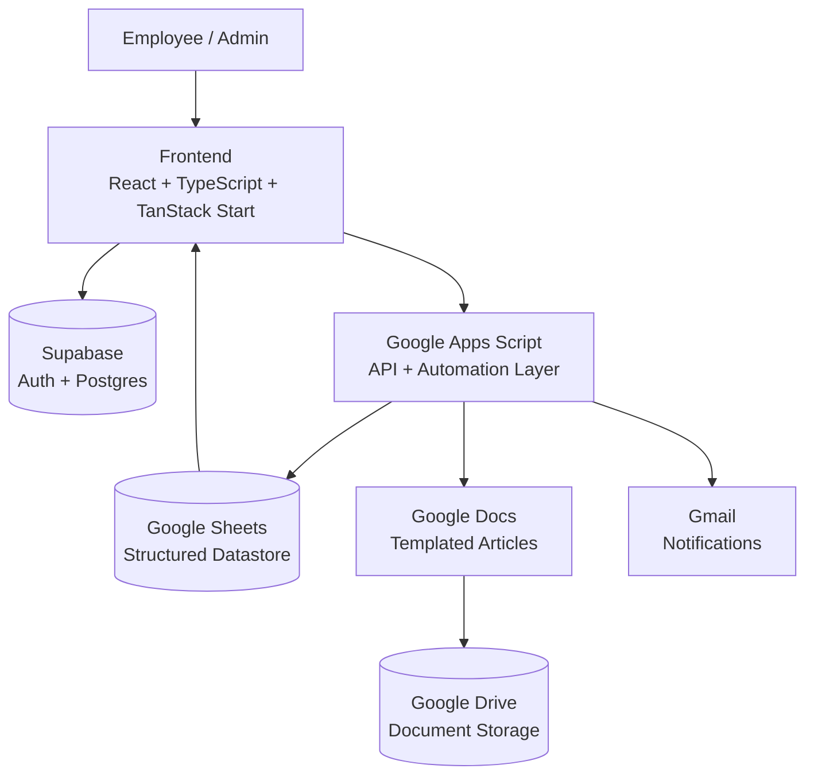
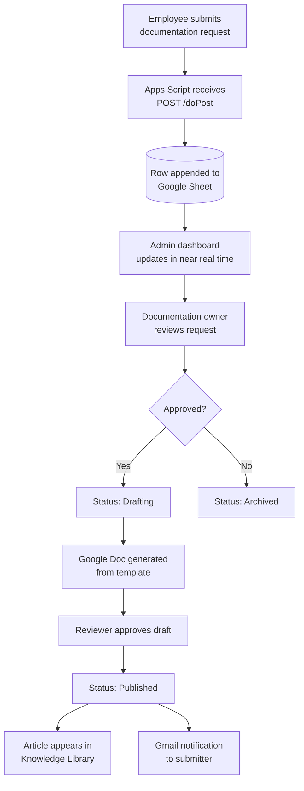

# Knowledge Hub

> An enterprise internal documentation and knowledge management platform built with React, TypeScript, Tailwind CSS, Supabase, Google Apps Script, and Google Workspace.


**Live Demo →** [knowledge-hub.tierrabcodes.workers.dev](https://knowledge-hub.tierrabcodes.workers.dev/)



---

## Overview

Knowledge Hub centralizes internal company knowledge and automates the documentation lifecycle end-to-end. Employees search a single, curated library of step-by-step guides; when a gap exists, they submit a documentation request that flows through a governed review, drafting, and approval pipeline before publication.

The platform is designed to:

- **Reduce repetitive IT support requests** by turning every ticket into reusable, published knowledge.
- **Improve employee self-service** with fast, editorial search and interactive walkthroughs.
- **Automate documentation workflows** using Google Apps Script as the orchestration layer and Google Sheets as the structured datastore.
- **Establish a single source of truth** for operational knowledge. Searchable, versioned, and governed.

> The result is a self-reinforcing system where support friction is continuously captured, validated, and converted into institutional knowledge.

---

## Key Features

| Feature | Description |
| --- | --- |
| Documentation Request Portal | Employees submit missing-documentation requests with category, priority, and context. |
| Internal Knowledge Library | Curated, category-organized articles with search, filters, and difficulty indicators. |
| AI-assisted Documentation | Concept UI for AI-generated drafts from imported source material. |
| Google Workspace Integration | Native pipeline across Sheets, Docs, Drive, and Gmail via Apps Script. |
| Google Sheets Database | Structured, auditable datastore for requests, statuses, and metadata. |
| Google Docs Generation | Standardized templates instantiated per approved article. |
| Status Workflow | Governed lifecycle: New → In Review → Drafting → Approved → Published. |
| Search & Filtering | Real-time keyword highlighting, category filters, and instant previews. |
| Dashboard Analytics | Operational KPIs: articles published, request throughput, health. |
| Live Request Tracking | Admins see requests update in near real time from Apps Script. |
| Documentation Approval Workflow | Explicit review + approval gates before publication. |
| Responsive Design | Fully responsive layouts across desktop, tablet, and mobile. |

---

## Screenshots

### Dashboard

> _Placeholder. Add `` when captured._

Operational hub for the documentation team. Surfaces live request volume, status distribution, quick actions, and workflow health at a glance.

### Documentation Requests

> _Placeholder. Add `images/documentation-requests.png` when captured._

Live table of employee-submitted requests with priority, owner assignment, and inline status transitions synced to the Google Sheet backend.

### Knowledge Library



Editorial library organized by domain (Account Access, Devices, Networking, Applications, Security, New Employee Setup, and more) with instant filter search.

### Category Deep-Dive



A category modal surfaces featured articles, full article listings, and per-category search without leaving the browse experience.

### Request / Article Details



Each article opens with an editorial header (breadcrumbs, category, difficulty, estimated time, common symptoms, and a structured overview) before the interactive walkthrough.

### Interactive Walkthrough



Step-by-step troubleshooting with progress tracking, keyboard navigation, and completion feedback. Each step is a discrete, testable unit of documentation.

### Analytics

> _Placeholder. Add `images/analytics.png` when captured._

Knowledge-health metrics: articles published, request-to-publish latency, deflection potential, and category coverage.

### Google Sheets Backend

> _Placeholder. Add `images/google-sheets-backend.png` when captured._

A structured Google Sheet acts as the operational datastore for documentation requests: `request_id`, `title`, `category`, `priority`, `status`, `owner`, `submitted_by`, `created_at`, `updated_at`.

### Google Apps Script Backend

> _Placeholder. Add `images/google-apps-script-backend.png` when captured._

A single `doPost` handler routes actions (`submitDocumentationRequest`, `getDocumentationRequests`, `updateDocumentationRequestStatus`, `submitArticleFeedback`) to typed service functions.

### Workflow

> _Placeholder. Add `images/workflow.png` when captured._

End-to-end visualization of the documentation lifecycle from employee submission through published article.

### Light & Dark Mode

| Light | Dark |
| --- | --- |
|  |  |

Theme-aware UI with editorial typography, high-contrast accents, and accessibility-first defaults in both modes.

---

## Architecture



The frontend calls Supabase for authenticated app data and Google Apps Script for documentation-workflow operations. Apps Script orchestrates Sheets (data), Docs (templated articles), Drive (storage), and Gmail (notifications) as a unified Google Workspace backend.

---

## Workflow



---

## Technology Stack

**Frontend**

| Technology | Role |
| --- | --- |
| React 19 | Component-based UI |
| TypeScript 5 | Type safety across the app |
| TanStack Start | Full-stack React framework, file-based routing, SSR |
| Vite 7 | Build tooling and dev server |
| Tailwind CSS 4 | Design tokens and utility styling |
| shadcn/ui + Radix | Accessible primitives (dialogs, menus, tooltips) |
| Recharts | Analytics visualization |
| React Hook Form + Zod | Typed forms and validation |

**Backend**

| Technology | Role |
| --- | --- |
| Supabase | Auth, Postgres, RLS-protected app data |
| Google Apps Script | REST-style API, workflow automation, Workspace orchestration |

**Google Workspace**

| Service | Role |
| --- | --- |
| Google Sheets | Structured datastore for requests + statuses |
| Google Docs | Templated article generation |
| Google Drive | Versioned document storage |
| Gmail | Transactional notifications and approval emails |

**Deployment & Ops**

| Technology | Role |
| --- | --- |
| Cloudflare Workers / Pages | Edge hosting for the TanStack Start app |
| GitHub | Source control and CI |

---

## Google Workspace Integration

Google Workspace functions as the operational backend for documentation workflows. All frontend traffic is routed through a single service module (`src/services/googleAppsScript.ts`) so the integration is centralized, typed, and swappable.

### Google Sheets | Datastore
- Row-per-request storage with `request_id`, `title`, `category`, `priority`, `status`, `owner`, `submitted_by`, `source`, `created_at`, `updated_at`.
- Status transitions are auditable and reversible.
- Serves as the source of truth for the admin dashboard.

### Google Docs | Article Templates
- Standardized documentation templates instantiated per approved request.
- Enforces consistent formatting: overview, symptoms, prerequisites, step-by-step fix.

### Google Drive | Storage & Versioning
- Generated Docs are organized into a configurable Drive folder.
- Native Google versioning provides history and rollback.

### Google Apps Script | API + Automation Engine
- Deployed as a Web App exposing a single `doPost` endpoint.
- Routes payloads by `action`: `submitDocumentationRequest`, `getDocumentationRequests`, `updateDocumentationRequestStatus`, `submitArticleFeedback`.
- Orchestrates Sheets ↔ Docs ↔ Drive ↔ Gmail as one workflow engine.

### Gmail | Notifications
- Submitters notified on status changes.
- Reviewers notified on new drafts pending approval.

---

## Documentation Workflow

```text
New  →  In Review  →  Drafting  →  Approved  →  Published  →  Archived
```

| Status | What happens |
| --- | --- |
| **New** | Request submitted by an employee. Written to the Sheet, surfaced on the admin dashboard. |
| **In Review** | Documentation owner triages priority, category, and duplication. |
| **Drafting** | Owner authors the article using the Google Doc template. |
| **Approved** | Reviewer signs off. Article is queued for publication. |
| **Published** | Article appears in the Knowledge Library and is searchable. Submitter is notified. |
| **Archived** | Rejected, duplicate, or retired requests. Retained for audit. |

---

## Dashboard Features

- Live documentation request feed synced from Google Sheets.
- Inline status transitions with optimistic UI updates.
- Priority + owner assignment.
- Knowledge metrics: total articles, published, in flight, requests received.
- Filter by status, category, and owner.
- Global search across titles and descriptions.
- Manual refresh with visible last-synced state.
- Near real-time updates on next fetch cycle.

---

## UI Design

> **Design language:** enterprise SaaS with an editorial voice.

- **Typography-forward.** Display serifs paired with a neutral sans body.
- **Generous whitespace** and a soft, paper-toned canvas.
- **Minimal chrome.** Content leads, controls recede.
- **High-contrast accents.** A single saturated highlight for emphasis (yellow marker) with theme-aware token overrides.
- **Responsive by default** across desktop, tablet, and mobile.
- **Accessibility-focused.** Semantic HTML, keyboard navigation, focus states, screen-reader labels.
- **Light & Dark modes** driven by design tokens in `src/styles.css`, not hardcoded colors.

---

## Engineering Highlights

- **Type-safe file-based routing** with TanStack Start (`src/routes/*`), including dynamic segments for articles and topics.
- **Reusable React component system** built on shadcn/ui + Radix primitives, extended with editorial-scale layouts.
- **Centralized backend adapter.** Every Apps Script call flows through `src/services/googleAppsScript.ts` with a discriminated `ApiResult<T>` union, so no component throws on network or configuration failure.
- **Config-driven backend URL** via `VITE_GOOGLE_APPS_SCRIPT_URL`, safe for per-environment rotation without touching code.
- **Google Sheets as a structured datastore** with a normalized row schema and status enum shared between frontend and Apps Script.
- **REST-shaped Apps Script API.** Single `doPost` dispatcher, action-based routing, JSON envelopes with explicit success/error contracts.
- **Workflow automation.** Status transitions trigger Doc generation, Drive placement, and Gmail notifications.
- **Design-token system.** Semantic tokens in `src/styles.css` power both light and dark themes; components never hardcode color.
- **SSR-ready architecture** on Cloudflare edge runtime via TanStack Start's Vite plugin.
- **Scalable component layout.** `components/`, `hooks/`, `data/`, `services/`, `routes/` cleanly separated.

---

## Future Enhancements

| Initiative | Description |
| --- | --- |
| AI Document Generation | Draft articles from ticket transcripts and imported source material. |
| Semantic Search | Intent-aware search over the full knowledge base. |
| Vector Search | Embedding-backed retrieval for related-article surfacing. |
| Slack Integration | Query and submit requests from Slack. |
| Microsoft Teams Integration | Surface articles inside Teams conversations. |
| Approval Automation | Rule-based auto-approval for low-risk categories. |
| Version History | First-class article versioning and rollback in-app. |
| Role-Based Permissions | Employee / Author / Reviewer / Admin scopes. |
| Audit Logging | Immutable log of every status transition and edit. |
| Analytics Dashboard v2 | Deflection rate, content gaps, search-to-hit funnels. |
| Knowledge Recommendations | Suggest related articles based on user context. |

---

## Project Structure

```text
knowledge-hub/
├── src/
│   ├── routes/                   # TanStack Start file-based routes
│   │   ├── __root.tsx            # App shell, head metadata, providers
│   │   ├── index.tsx             # Homepage
│   │   ├── topics.tsx            # Browse all topics
│   │   ├── topics.$slug.tsx      # Category detail
│   │   ├── articles.$slug.tsx    # Article walkthrough
│   │   ├── request.tsx           # Documentation request form
│   │   ├── admin.tsx             # Admin dashboard
│   │   └── admin-preview.tsx     # Admin preview surface
│   ├── components/               # Reusable UI + page sections
│   ├── hooks/                    # Theme, in-view, mobile helpers
│   ├── data/                     # Article + category source data
│   ├── services/
│   │   └── googleAppsScript.ts   # Single backend adapter
│   ├── lib/                      # Utilities, error capture, reporting
│   ├── styles.css                # Tailwind v4 tokens + theme
│   ├── router.tsx                # Router bootstrap
│   ├── start.ts                  # TanStack Start client entry
│   └── server.ts                 # Edge server entry
├── images/                       # README screenshots
├── docs/developer/               # Developer documentation
├── vite.config.ts
├── tsconfig.json
└── package.json
```

---

## Installation

```bash
# Install dependencies
npm install

# Start the dev server
npm run dev

# Production build
npm run build

# Preview the production build
npm run preview
```

---

## Environment Variables

Copy `.env.example` to `.env.local` and populate the values before running the project:

| Variable | Required | Description |
|----------|----------|-------------|
| VITE_GOOGLE_APPS_SCRIPT_URL | Yes | Google Apps Script Web App deployment URL |
| VITE_GOOGLE_SHEET_ID | Optional | Google Spreadsheet ID used by Apps Script |
| VITE_GOOGLE_DRIVE_FOLDER_ID | Optional | Google Drive folder used for documentation |

```bash
cp .env.example .env.local
# then edit .env.local with your values
bun install && bun dev
```

> `.env` and `.env.local` are git-ignored. Only `.env.example` is committed. Never commit endpoint URLs or keys; rotate the Apps Script deployment if the URL leaks.

See [`docs/developer/environment.md`](docs/developer/environment.md) for full deployment and action-reference notes.

---

## Author

**Tierra Barrow**
AI Support Operations Manager • AI Automation Consultant

- **Live Site:** [knowledge-hub.tierrabcodes.workers.dev](https://knowledge-hub.tierrabcodes.workers.dev/)
- **GitHub:** [@tcodes27](https://github.com/tcodes27)

Knowledge Hub was designed to demonstrate how thoughtful product design, workflow automation, and Google Workspace orchestration can turn everyday IT support friction into a scalable, self-improving knowledge system.
